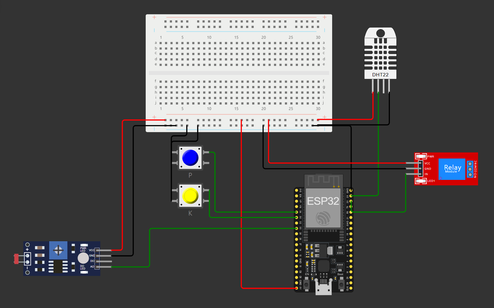

# FIAP - Faculdade de Informática e Administração Paulista

<p align="center">
<a href= "https://www.fiap.com.br/"></a>
</p>

<br>

# Cap 1 - Máquina Agrícola

## Nome do grupo

## 👨‍🎓 Integrantes: 
- Gustavo Valtrick - RM559575
- Iago Cotta - RM559655
- Pedro Scofield - RM560589
- Rodrigo Mastropietro - RM560081
- Tiago de Andrade Bastos - RM560467

## 👩‍🏫 Professores:
### Tutor(a) 
- <a href="https://www.linkedin.com/in/lucas-gomes-moreira-15a8452a/">Lucas Gomes Moreira</a>
### Coordenador(a)
- <a href="https://www.linkedin.com/in/profandregodoi/">André Godoi</a>


## 📜 Descrição

Este projeto implementa um sistema de monitoramento e irrigação inteligente para agricultura, utilizando sensores IoT e um banco de dados Oracle. O sistema coleta dados de temperatura, umidade, níveis de nutrientes (P e K) e pH do solo.

Principais características:
- Coleta e armazenamento de dados de sensores
- Dashboard para visualização de dados
- Controle automático de irrigação baseado em condições do solo
- Integração com previsão do tempo para otimização da irrigação
- Interface de linha de comando para gerenciamento do sistema

### Link youtube demonstrando funcionamento do projeto
- [Link do vídeo](https://www.youtube.com)

### Diagrama eletrônico do projeto com ESP32
<p align="center">

</p>

<br>

#### O diagrama apresentado utiliza os seguintes sensores e componentes para simular o monitoramento de uma cultura:

- Sensor de umidade e temperatura do solo DHT22;
- LDR, com leitura anlógica como simulador de sensor de pH do solo;
- Dois pushbuttons para simular a leitura de nutrientes P e K (presentes no solo ou ausentes no solo);
- Um relé para simular o acionamento de uma bomba de água para irrigação.

#### Critérios Utilizados para a ativação da bomba de água (irrigação) - presentes no código C++ utilizado para programar a ESP32:

- Umidade do solo abaixo de 55%;
- Umidade adequada porém temperatura alta, acima de 35ºC;
- pH acima de 7.5 (alcalino) e ausência de nutrientes P e/ou K.

## 📁 Estrutura de pastas

Dentre os arquivos e pastas presentes na raiz do projeto, definem-se:

- <b>.github</b>: Nesta pasta ficarão os arquivos de configuração específicos do GitHub que ajudam a gerenciar e automatizar processos no repositório.

- <b>assets</b>: aqui estão os arquivos relacionados a elementos não-estruturados deste repositório, como imagens.

- <b>config</b>: Utilizada para armazenar arquivos de configuração do projeto, como o config.json, utilizado para as credenciais do Banco de Dados (não é a uma solução profissional adequada, mas atende aos requisitos acadêmicos do projeto).

- <b>document</b>: não utilizada nesse projeto

- <b>scripts</b>: não utilizada nesse projeto

- <b>src</b>: Todo o código fonte criado para o desenvolvimento do projeto.

- <b>README.md</b>: arquivo que serve como guia e explicação geral sobre o projeto (o mesmo que você está lendo agora).

## 🔧 Como executar o código

1. Certifique-se de ter Python 3.7+ instalado em seu sistema.

2. Clone o repositório:
   ```
   git clone https://github.com/rmpietro/FIAP_fase3_cap1_maquina_agricola.git
   cd nome-do-repositorio
   ```

3. Instale as dependências:
   ```
   pip install oracledb pandas requests
   ```

4. Configure as credenciais do banco de dados Oracle no arquivo `config.json` ou siga as instruções durante a execução para criar o arquivo.

5. Execute o script principal:
   ```
   python main.py
   ```

6. Siga as instruções no menu para criar tabelas, inserir dados, iniciar o dashboard ou obter previsões de chuva.

Nota: Certifique-se de ter acesso a um banco de dados Oracle e as credenciais necessárias antes de executar o projeto.

### Script R
O script R executa análise estatística e preditiva exibindo tabelas e gráficos com os dados coletados.
Ele deve ser executado de modo separado do programa em Python e preferencialmente no RStudio.

#### Para executar o script R:
1. Abra o RStudio
2. Escolha a opção source no canto superior esquerdo da janela de código e selecione o arquivo do script, localizado neste projeto na pasta:

``` 
src/R/analysis_stats.R
```

## 🗃 Histórico de lançamentos

* 0.1.0 - 13/11/2024

## 📋 Licença

<p xmlns:cc="http://creativecommons.org/ns#" xmlns:dct="http://purl.org/dc/terms/"><a property="dct:title" rel="cc:attributionURL" href="https://github.com/agodoi/template">MODELO GIT FIAP</a> por <a rel="cc:attributionURL dct:creator" property="cc:attributionName" href="https://fiap.com.br">Fiap</a> está licenciado sobre <a href="http://creativecommons.org/licenses/by/4.0/?ref=chooser-v1" target="_blank" rel="license noopener noreferrer" style="display:inline-block;">Attribution 4.0 International</a>.</p>


